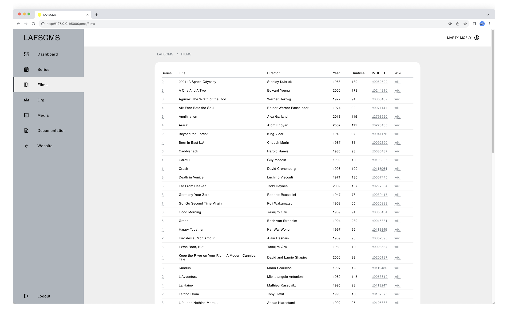

# LAFS-CMS

A bespoke Content Management System (CMS)

## Table of Contents

> [!NOTE]
> ALL CONTENTS IN THIS REPO ARE FOR EDUCATIONAL PURPOSES ONLY.

* [Description](#description)
* [Target Users](#target-users)
* [Features](#features)
* [Project Structure](#project-structure)
* [Quick Start](#quick-start)
* [Local Setup](#local-setup)
  * [Prerequisites](#prerequisites)
  * [Dependencies](#dependencies)
  * [Installation](#installation)
  * [Configuration](#configuration)
* [Usage](#usage)
* [Production Setup](#production-setup)
* [System Administration](#system-administration)
* [Author(s)](#authors)
* [Version History](#version-history)
  * [Release Notes](#release-notes)
  * [Initial Release](#initial-release)
* [Future Work](#future-work)
* [License](#license)
* [Contributing](#contributing)
* [Acknowledgments](#acknowledgments)
* [Screenshots](#screenshots)

## Description

_LAFS-CMS_ is a bespoke Content Management System (CMS) developed for the resurrected website of the _Landscape Architecture Film Series_, a student-led initiative which I co-founded and co-curated for the [Department of Landscape Architecture](https://landarch.illinois.edu/) at the University of Illinois Urbana-Champaign in the early 2000s.

Just like any organization in the real world, student-run organizations such as a film series experience [organizational knowledge loss (KLT)](https://www.emerald.com/insight/content/doi/10.1108/tlo-09-2022-0108/full/html) when their members graduate. Without a knowledge transfer process, this loss can lead to technical resources being underutilized or becoming inactive. While alternative resources and processes may exist, they either need to be created from scratch, requiring significant time and resources, or are imperfect substitutes. If existing resources work perfectly fine, why go through all that effort?

_LAFS-CMS_, then, was conceived as an Information System solution for mitigating KLT by simplifying content management. With its user-friendly web interface and automated workflows, it aims to significantly lower technical barriers, enabling all members—regardless of technical expertise—to easily curate public-facing content and internal administrative resources.

To learn how this project came about, check out [_LAFS-DEV_](https://github.com/ggeerraarrdd/lafs-dev).


## Target Users

_LAFS-CMS_ is intended for:

* **Self-guided Learners** seeking reference full-stack implementation of a Content Management System (CMS) implementations through practical examples.
* **Information Systems students** researching organizational knowledge, in general, and knowledge loss induced by organizational member turnover (KLT) and technical solutions to KTL, specifically.

## Features

* 📝 **Content Management** - Complete film series content lifecycle with CRUD operations, calendaring, and media management
* 🔐 **User Management** - Role-based access control system with streamlined permissions and self-service registration workflow
* 🖥️ **Interface** - User-friendly dashboard with responsive design, real-time previews, and collaborative editing tools
* 📚 **Knowledge Continuity Framework** - Systematic documentation in a centralized repository

## Project Structure

```txt
lafs-dev/
│
├── app/
│   │
│   ├── blueprints/
│   │   │
│   │   ├── cms/
│   │   │    ├── __init__.py
│   │   │    ├── routes.py
│   │   │    ├── static/
│   │   │    └── templates/
│   │   │
│   │   └── main/
│   │       ├── __init__.py
│   │       ├── routes.py
│   │       ├── static/
│   │       └── templates/
│   │
│   ├── config/
│   │   └── __init__.py
│   │
│   ├── crud/
│   │   └── __init__.py
│   │
│   ├── data/
│   │   └── lafs.db
│   │
│   ├── infra/
│   │   └── __init__.py
│   │
│   ├── utils/
│   │   └── __init__.py
│   │
│   └── app.py
│
├── logs/
│
├── docs/
├── .gitignore
├── LICENSE
├── README.md
└── requirements.txt
```

## Quick Start

For those who want to get up and running quickly with default settings:

```bash
# Clone repo
git clone https://github.com/ggeerraarrdd/lafs-cms.git
cd lafs-cms

# Set up environment
python3 -m venv venv
source venv/bin/activate  # Windows: venv\Scripts\activate
pip install -r requirements.txt

# Run app
cd app
flask run

# Navigate to the URL specified in the terminal output
# Add '/cms' at the end of the URL
```

## Local Setup

### Prerequisites

Before you begin, ensure you have met the following requirements:

1. **Development Tools**

    * Python 3.12 (not tested on other versions)
    * [git](https://git-scm.com/) (for cloning the repository)

2. **Google Maps API Key**

    For the embedded maps to work, you need to set up a Google Maps API Key. Before you can create one, you will need to create a Google Cloud project, for which you need a Google Cloud account.

    * [Set up a Google Cloud account](https://cloud.google.com)
    * [Set up your Google Cloud project](https://developers.google.com/maps/documentation/javascript/cloud-setup)
    * [Create and configure your API Key](https://developers.google.com/maps/documentation/javascript/get-api-key)

### Dependencies

* See `requirements.txt`

### Installation

1. **Clone the repository**

    ```bash
    git clone https://github.com/ggeerraarrdd/lafs-cms.git
    cd lafs-cms
    ```

2. **Set up a Python virtual environment**

    ```bash
    python3 -m venv venv
    source venv/bin/activate  # On Windows use `venv\Scripts\activate`
    ```

3. **Install the dependencies**

    ```bash
    pip install --upgrade pip
    pip install -r requirements.txt
    ```

### Configuration

1. **Create an `.env` file**

    Place the file in the root directory and add the following as default:

    ```python
    # Database Path
    DATABASE_NAME='data/lafs.db'

    # Database Connection Pool
    POOL_SIZE=5
    MAX_OVERFLOW=10
    POOL_TIMEOUT=30
    POOL_RECYCLE=-1
    ECHO=False

    # Database Retry Settings
    MAX_RETRIES=3
    BASE_DELAY=1
    MAX_DELAY=10

    # Flask Secret Key
    SECRET_KEY='192b9bdd22ab9ed4d12e236c78afcb9a393ec15f71bbf5dc987d54727823bcbf'

    # Google Maps API Key
    MAP_API_KEY='your_map_api_key'
    ```

2. **Database Options Explained**

    `DATABASE_NAME` - path to SQLite database file

    SQLAlchemy [Engine/Connection Pool](https://docs.sqlalchemy.org/en/20/core/engines_connections.html) Parameters:
    * `POOL_SIZE` - max number of persistent connections
    * `MAX_OVERFLOW` - max number of connections above POOL_SIZE
    * `POOL_TIMEOUT` - seconds to wait for available connection
    * `POOL_RECYCLE` - seconds before connection is recycled
    * `ECHO` - enable SQLAlchemy engine logging

    Custom Retry Mechanism Parameters:
    * `MAX_RETRIES` - max retry attempts for failed operations
    * `BASE_DELAY` - initial delay between retries in seconds
    * `MAX_DELAY` - max delay between retries in seconds

3. **Flask Secret Key Options Explained**

    From Flask's [official documentation](https://flask.palletsprojects.com/en/stable/config/): _A secret key that will be used for securely signing the session cookie and can be used for any other security related needs by extensions or your application. It should be a long random bytes or str. For example, copy the output of this to your config:_

    ```bash
    $ python -c 'import secrets; print(secrets.token_hex())'
    '192b9bdd22ab9ed4d12e236c78afcb9a393ec15f71bbf5dc987d54727823bcbf'
    ```

    The above is used as system default for local development. You can generate a new one using the `secrets` module fro Python standard library or using your preferred method.

4. **Google Maps API Key Options Explained**

    While needed for the embedded maps in the website to work, a Google Maps API Key is optional for the CMS.

## Usage

1. **Go into the app directory and run the command**

    ```bash
    flask run
    ```

2. **Open the film series website**

    Navigate to the URL specified in the terminal output. For example:

    ```bash
    * Running on http://127.0.0.1:5000
    ```

3. **Access the CMS**

    Add `/cms` at the end of the URL.

## Production Setup

* TBD

## System Administration

* TBD

## Author(s)

* [@ggeerraarrdd](https://github.com/ggeerraarrdd/)

## Version History

### Release Notes

* See [https://github.com/ggeerraarrdd/lafs-cms/releases](https://github.com/ggeerraarrdd/lafs-cms/releases)

### Initial Release

* TBD

## Future Work

* TBD

## License

* [MIT License](https://github.com/ggeerraarrdd/large-parks/blob/main/LICENSE)

## Contributing

* TBD

## Acknowledgments

* Coeus

## Screenshots





## Frontispiece

* TBD
