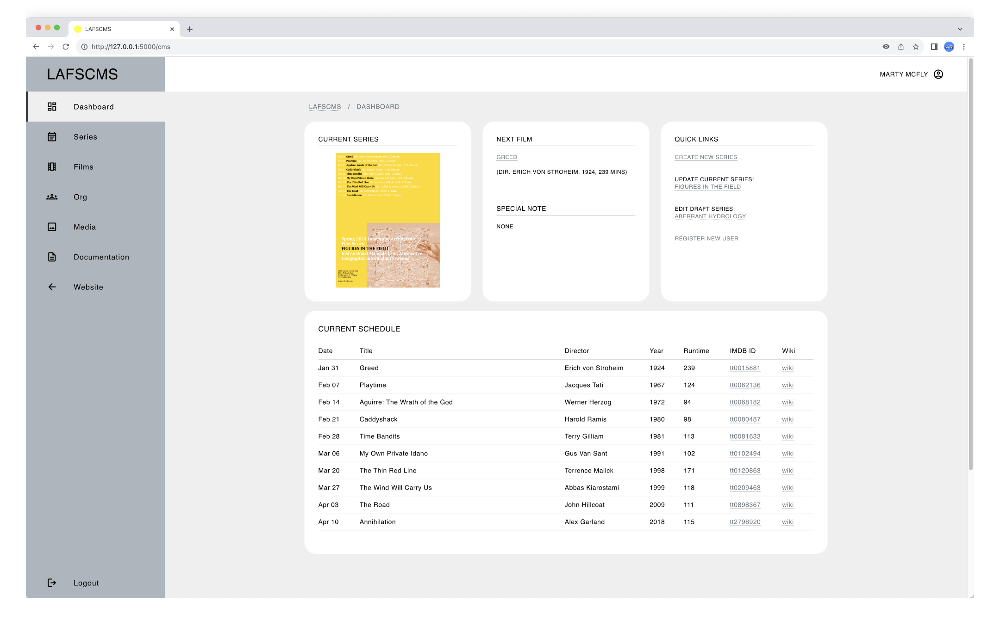

# LAFS-CMS

A bespoke Content Management System (CMS)

## Table of Contents

> [!NOTE]
> ALL CONTENTS IN THIS REPO ARE FOR EDUCATIONAL PURPOSES ONLY.

* [Description](#description)
* [Target Users](#target-users)
* [Features](#features)
* [Project Structure](#project-structure)
* [Prerequisites](#prerequisites)
* [Getting Started](#getting-started)
  * [Dependencies](#dependencies)
  * [Installation](#installation)
  * [Configuration](#installation)
* [Usage](#usage)
* [System Administration](#system-administration)
* [Author(s)](#authors)
* [Version History](#version-history)
  * [Release Notes](#release-notes)
  * [Initial Release](#initial-release)
* [Future Work](#future-work)
* [License](#license)
* [Contributing](#contributing)
* [Acknowledgments](#acknowledgments)
* [Screenshots](#screenshots)

## Description

_LAFS-CMS_ is a bespoke Content Management System (CMS) developed for the resurrected website of the _Landscape Architecture Film Series_, a student-led initiative which I co-founded and co-curated for the [Department of Landscape Architecture](https://landarch.illinois.edu/) at the University of Illinois Urbana-Champaign in the early 2000s.

Just like any organization in the real world, student-run organizations such as a film series experience [organizational knowledge loss (KLT)](https://www.emerald.com/insight/content/doi/10.1108/tlo-09-2022-0108/full/html) when their members graduate. Without a knowledge transfer process, this loss can lead to technical resources being underutilized or becoming inactive. While alternative resources and processes may exist, they either need to be created from scratch, requiring significant time and resources, or are imperfect substitutes. If existing resources work perfectly fine, why go through all that effort?

_LAFS-CMS_, then, was conceived as an Information System solution for mitigating KLT by simplifying content management. With its user-friendly web interface and automated workflows, it aims to significantly lower technical barriers, enabling all members—regardless of technical expertise—to easily curate public-facing content and internal administrative resources.

To learn how this project came about, check out [_LAFS-DEV_](https://github.com/ggeerraarrdd/lafs-dev).



## Target Users

* TBD

## Features

* TBD

## Project Structure

```txt
lafs-dev/
│
├── app/
│   │
│   ├── blueprints/
│   │   │
│   │   ├── cms/
│   │   │    ├── __init__.py
│   │   │    ├── routes.py
│   │   │    ├── static/
│   │   │    └── templates/
│   │   │
│   │   └── main/
│   │       ├── __init__.py
│   │       ├── routes.py
│   │       ├── static/
│   │       └── templates/
│   │
│   ├── config/
│   │   └── __init__.py
│   │
│   ├── crud/
│   │   └── __init__.py
│   │
│   ├── data/
│   │   └── lafs.db
│   │
│   ├── infra/
│   │   └── __init__.py
│   │
│   ├── utils/
│   │   └── __init__.py
│   │
│   └── app.py
│
├── logs/
│
├── docs/
├── .gitignore
├── LICENSE
├── README.md
└── requirements.txt
```

## Prerequisites

* TBD

## Getting Started

### Dependencies

* See `requirements.txt`

### Installation

1. **Clone the repository**

    ```bash
    git clone https://github.com/ggeerraarrdd/lafs-dev.git
    ```

2. **Set up a Python virtual environment**

    ```bash
    python3 -m venv venv
    source venv/bin/activate  # On Windows use `venv\Scripts\activate`
    ```

3. **Install the dependencies**

    ```bash
    pip install --upgrade pip
    pip install -r requirements.txt
    ```

### Configuration

1. **Create an `.env` file**

    Place the file in the root directory and add the following as default:

    ```python
    # Database Path
    DATABASE_NAME='data/lafs.db'

    # Database Connection Pool
    POOL_SIZE=5
    MAX_OVERFLOW=10
    POOL_TIMEOUT=30
    POOL_RECYCLE=-1
    ECHO=False

    # Database Retry Settings
    MAX_RETRIES=3
    BASE_DELAY=1
    MAX_DELAY=10

    # Flask Secret Key
    SECRET_KEY='your_flask_secret_key'

    # Google Maps API Key
    MAP_API_KEY='your_map_api_key'
    ```

2. **Database**

    ```python
    # Database Path
    DATABASE_NAME='data/lafs.db'  # Path to SQLite database file

    # Database Connection Pool
    POOL_SIZE=15   # Max number of persistent connections
    MAX_OVERFLOW=5  # Max number of connections above POOL_SIZE
    POOL_TIMEOUT=30  # Seconds to wait for available connection
    POOL_RECYCLE=1800  # Seconds before connection is recycled
    ECHO=False  # Enable SQLAlchemy engine logging

    # Database Retry Settings
    MAX_RETRIES=3  #  Max retry attempts for failed operations
    BASE_DELAY=1  # Initial delay between retries in seconds
    MAX_DELAY=10  # Max delay between retries in seconds
    ```

3. **Flask Secret Key**

    ```python
    # Flask Secret Key
    SECRET_KEY='your_flask_secret_key'
    ```

4. **Google Maps API Key**

    ```python
    # Google Maps API Key
    MAP_API_KEY='your_map_api_key'
    ```

    An API Key is needed for the embedded map to work. Before you can create one, you will need to create a Google Cloud project, for which you need a Google Cloud account.

    * [Set up a Google Cloud account](https://cloud.google.com)
    * [Set up your Google Cloud project](https://developers.google.com/maps/documentation/javascript/cloud-setup)
    * [Using API Keys](https://developers.google.com/maps/documentation/javascript/get-api-key)

## Usage

1. **Go into the app directory and run the command**

    ```bash
    flask run
    ```

2. **Open the film series website**

    Copy and open the URL displayed after 'Running on' in the terminal.

3. **Access the CMS**

    Add `/cms` at the end of the URL.

## System Administration

* TBD

## Author(s)

* [@ggeerraarrdd](https://github.com/ggeerraarrdd/)

## Version History

### Release Notes

* See [https://github.com/ggeerraarrdd/lafs-cms/releases](https://github.com/ggeerraarrdd/lafs-cms/releases)

### Initial Release

* TBD

## Future Work

* TBD

## License

* [MIT License](https://github.com/ggeerraarrdd/large-parks/blob/main/LICENSE)

## Contributing

* TBD

## Acknowledgments

* Coeus

## Screenshots


## Frontispiece

* TBD
